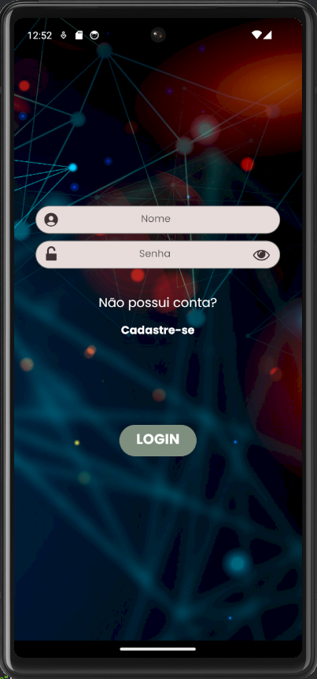
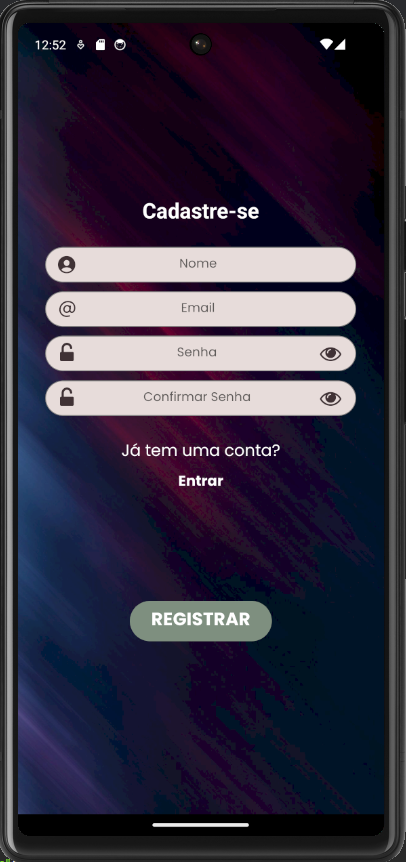
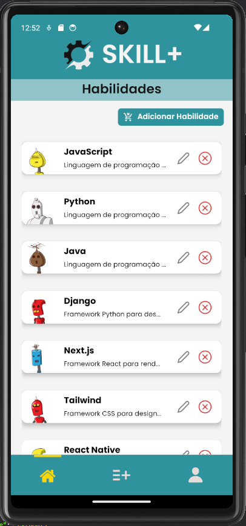

# SKILL+ Mobile

Aplicativo mobile desenvolvido para um processo seletivo. Ele foi construído usando React Native e possui autenticação via AsyncStorage, gerenciamento de formulários com React Hook Form, validação com Yup Resolver, requisições API com Axios e navegação com React Navigation.

## Tecnologias Utilizadas

- **React Native**: Framework para desenvolvimento de aplicativos móveis.
- **React Hook Form**: Biblioteca para gerenciamento de formulários.
- **Yup Resolver**: Biblioteca para validação de dados.
- **AsyncStorage**: Usado para armazenamento local.
- **Axios**: Usado para fazer requisições HTTP.
- **React Navigation**: Usado para navegação entre as telas do aplicativo.

## Como Executar o Projeto

1. Clone o repositório para a sua máquina local usando `git clone https://github.com/lucastere10/neki-processo-mobile`
2. Mude para o diretório do projeto: `cd NOME_DO_PROJETO`
3. Instale todas as dependências usando `yarn install` ou `npm install`
4. Inicie o servidor usando `yarn start` ou `npm start`

Abra o aplicativo Expo no seu celular e escaneie o QR Code.

## Contribuição

Contribuições são sempre bem-vindas. Para contribuir:

## Telas

